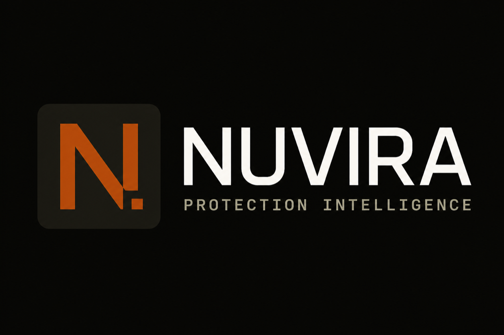

# Nuvira

Humanitarian data protection intelligence. Nuvira scans OneDrive, Slack, and Outlook content for names, case numbers, GPS, and medical data, cites ICRC / GDPR / Sphere policy, and records a hash-chained audit trail.

**Live (reserved host):** [https://nuvira-blush.vercel.app](https://nuvira-blush.vercel.app)

Logo files: `client/public/logo.png` (mark), `client/public/favicon.png`, `client/public/nuvira-logo.png` (lockup).

## Features

- Scan pasted or uploaded OneDrive, Slack, or Outlook content
- Detect names, case numbers, GPS coordinates, and medical data
- Built-in ICRC, GDPR, and Sphere Standards policy corpus
- Human approval before every redact or access-revocation
- Hash-chained, tamper-evident audit log
- Recurrence detection for previously remediated assets
- Demo mode with three synthetic humanitarian datasets
- Control room: Scan, Findings, Approvals, Audit

## Setup

Local install, samples, scripts, and troubleshooting: [SETUP.md](SETUP.md).

License: [MIT](LICENSE).

## Deployment intent

The production target is **AWS**. The current public URL on Vercel is a time-box reservation so the control room can be tried while that work is unfinished.

### Why AWS

- Run the Express + tRPC server as a long-lived Node process (ECS Fargate or App Runner), not a serverless function
- Keep Cockroach (or RDS Postgres) on a private network with Secrets Manager for `DATABASE_URL`
- Put the Vite static client on S3 + CloudFront
- Add an ALB, WAF, and structured logs (CloudWatch) in front of Scan / Approve / Remediate

### Roadmap

1. Containerise `pnpm build && node dist/index.js` (ALB health check on `/`)
2. Move secrets out of Vercel env into AWS Secrets Manager
3. Private connectivity from the service to Cockroach / RDS
4. CloudFront for `/samples/*` and the control-room assets
5. Cut DNS from the reserved Vercel host to the AWS ALB / CloudFront distribution
6. Decommission the Vercel reservation

Until that cutover, treat [https://nuvira-blush.vercel.app](https://nuvira-blush.vercel.app) as a holding deployment, not the intended production architecture.
